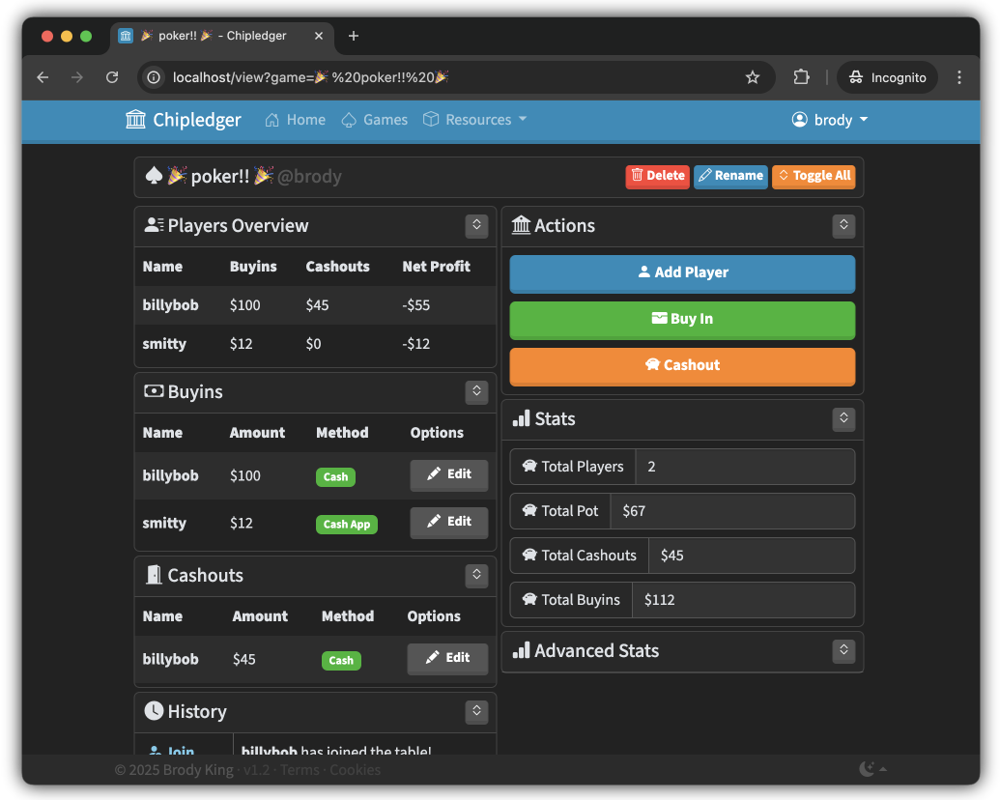

<h1>Chipledger </h1>

Chipledger is a web app that tracks buyins and cashouts for poker/blackjack home games.



<p align="center">
<a href="https://chipledger.com"><b>Chipledger.com</b></a> - <a href="https://chipledger.com/docs/"><b>Documentation</b></a><br><br>
</p>

## v1.2 Release Notes

Here are the changes made to the v1.3 Feature Update:<br>


## Requirements
This project uses/requires:

- [**PHP 8**](https://www.php.net/) - Backend use for API and Database. Used lightly on frontend.
- [**Apache**](https://httpd.apache.org/) - Web server. You can use nginx instead if you configure it right.
- [**SQLite**](https://sqlite.org/) - Database.
- [**Bootstrap**](https://github.com/twbs/bootstrap) - Styling
- [**Bootswatch**](https://github.com/thomaspark/bootswatch/) - Even more styling ontop of Bootstrap.

Bootstrap, and Bootswatch are included in the repo. No need to download elsewhere.

## Install

Clone the repo from GitHub, or download it. 

```bash
git clone https://github.com/brodyking/chipledger.git
```

Ensure you have `mod_rewrite` enabled. It will break if not enabled. Also ensure your hosting provider/local env has SQLite functionality with PHP.

Start your web server in the root directory of the project *(the one with this README in it)*.

For more information, checkout the [documentation](https://chipledger.com/docs)

## Roadmap

- [x] Authentication
- [x] Stored games
- [x] Landing page
- [x] Mobile focus/PWA
- [x] More interesting splash page
- [x] Track transaction method (venmo/cash/etc)
- [x] Editing values
- [ ] Find the meaning of life